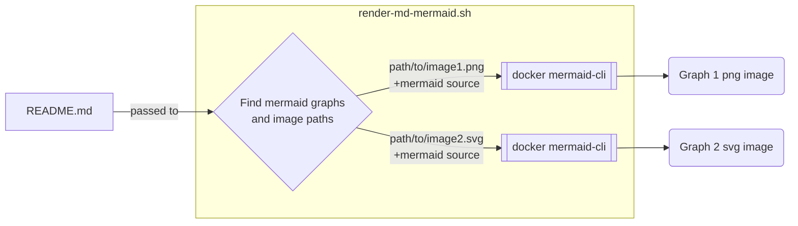

# render-md-mermaid

Utility for rendering Mermaid-JS diagrams in MD files for display on GitHub. GitHub Action coming soon.

Documentation is good. Diagrams are good. But with all good things, if they are hard to do, we do less of them. This tool makes including Mermaid diagrams in Markdown documents a breeze. It uses a simple trick that hides the diagram source on GitHub and displays a rendered diagram image. Keeping diagrams up-to-date is easy because the diagram source is in the Markdown files. No need to go off to the live-editor and copy things back and forth.

For a great editing experience (including live-rendering of your mermaid graphs), give [Typora](https://typora.io) a try.

## render-md-mermaid.sh

This script can be invoked on any Markdown file to render embedded mermaid diagrams, provided they are presented in the following format:

~~~markdown

  
diagram source

  This details block is collapsed by default when viewed in GitHub. This hides the mermaid graph definition, while the rendered image
  linked above is shown. The details tag has to follow the image tag. (newlines allowed)

~~~

The script will pick up the graph definition from the mermaid code block and render it to the image file and path specified in the
image tag using [mermaid-cli](https://github.com/mermaid-js/mermaid-cli). The rendered image can be in svg or png format, whatever is specified will be generated. The result is rendered as follows:

  
diagram source

  This details block is collapsed by default when viewed in GitHub. This hides the mermaid graph definition, while the rendered image
  linked above is shown. The details tag has to follow the image tag. (newlines allowed)

## Makefile include

This repo can be used as a submodule by running: `git submodule add git@github.com:nielsvaneck/render-md-mermaid.git SUBMODULE/DIRECTORY` in the root of your git repository.

It offers `render-md-mermaid.mk` as a Makefile include. See `Makefile` for an example integration.

Once `render-md-mermaid.mk` is included, `make render-md-mermaid` will invoke the `render-md-mermaid.sh` script on all Markdown files in the repository and write rendered diagrams to the specified image files.

## GitHub Action

WIP
